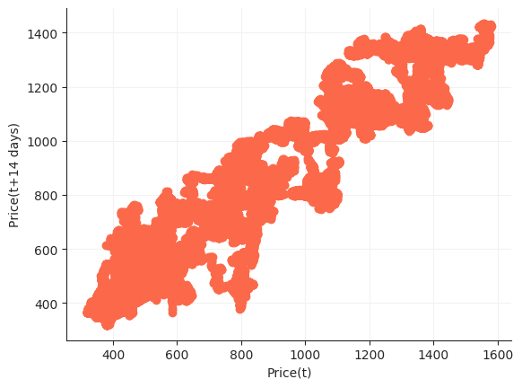

# Introduction
In this project a Deep Reinforcement Learning Algorithm is developed to increase the profits from a given stock. A supervised learning algorithm has also been implemented using classification to predict the future stock prices and maximize profits using the predictions. The results from both methods are compared.

# Motivation

Machine Learning has unprecedented applications in the finance sector. The accuracy of prediction has been greatly improved with the advent of Reinforcement Learning and Artificial Intelligence. The methods explored here provide a quantitative juxtaposition of RL and Supervised Learning showing that using the former is more profitable.


---

# Methods Explored
## SVM
**Support-Vector Machines** are supervised learning models that analyse data for classification and regression analyses. Each data point is viewed as a *p*-dimensional vector and the model aims to classify these data points using a *(p-1)*-dimensional hyperplane. The best hyperplane is that which has the largest margin between the two classes. In case the data points are not linearly separable, we map them to a higher dimensional space where they can be easily separated. Kernel functions are used for the same, depending on the type of data in concern.

- Linear Kernel is the best option when the dataset is linearly separable.

- Radial Basis Function Kernel is used to map data points to an infinite-dimensional hyperspace to separate them. However, this often leads to overfitting and so we use generalisation to stop that.

- Polynomial Kernel is used to map data points to a higher dimension by using a polynomial function of degree *d*. Using a higher degree tends to overfit the data.

## Deep Q-Learning
### Q-Learning 
**Reinforcement Learning** is a process in which an *agent* is confined to an *environment* and tasked with learning how to *behave optimally* under different circumstances by interacting with the environment. The different circumstances the agent is subjected to, are called *states*. The goal of the agent is to know what *action*, amongst a set of allowed actions, must it take such as to yield maximum *reward*. 

**Q-Learning** is a type of RL which uses *Q-Values* i.e., action values, to improve the behaviour of the agent in an iterative process. These Q-Values are defined for states and actions. Thus, `Q(S, A)` is an estimate of the quality of the action `A` at state `Q`. `Q(S, A)` can be represented in terms of the Q-value of the next state `S'` as follows - 


This is the *Bellman Equation*. It shows that the maximum future reward equals the reward received by the agent for entering the current state `S` added to the maximum future reward for the next state `S'`. With Q-Learning, the Q-values can be approximated iteratively with the help of the Bellman equation. This is also called Temporal Difference or *TD-Update rule* - 


Here, 
- S<sub>t</sub> is the current state and A<sub>t</sub> is the action picked according to the *policy*.
- S<sub>t+1</sub> is the next state and A<sub>t+1</sub> is the next action considered to effectively have maximum Q-value in the next state.
- `r` is the current reward obtained on the current action.
- `Gamma` has values in the interval (0, 1] and is called the *discount factor* for future rewards. Future rewards are considered to be less valuable than current ones and are therefore discounted.
- `Alpha` is the learning rate or the step length for updating the Q-values. 

A simple policy commonly used is the *E-greedy policy*. Here, `E` is also called the *exploration*. This signifies -

- The agent chooses the action with the highest Q-value with a probability `1-E`.
- The agent chooses the action at random with a probability `E`.
Thus, a high exploration implies that the agent will explore more actions at random. 

### The "Deep" in Deep Q-Learning 


Q-Learning aims to create a Q-state vs action matrix for the agent which it uses to maximize its reward. However, this is highly impractical for real-world problems where there can be a huge number of states and actions associated. To solve this problem, it is inferred that the values in the Q-matrix are related to each other. Therefore, instead of actual values, approximate values can be used so long as the relative importance is preserved. Therefore, to approximate these values, a neural network is used. Due to the incorporation of neural network, it is called Deep Q-Learning. 

The working step for Deep Q-Learning is to feed the neural network with an initial state, which returns the Q-value of all possible actions as a result. *Experience Replay* is essentially a way of logically separating the learning phase from gaining experience. The system stores the agent's experience e<sub>t</sub> = (s<sub>t</sub>, a<sub>t</sub>, r<sub>t</sub>, s<sub>t+1</sub>) and learns from it. This gives an advantage because the model makes use of previous experience by learning from it multiple times. When gaining real-world experience is expensive, experience replay is used to get maximum learning from previous experiences.

Therefore, Deep Q-Learning is a process in which an agent iteratively learns to maximize its reward in a given environment by exploring many possible actions at each achieved state using an E-greedy policy and a neural network to approximate Q-values.

---

# Data
Any kind of Financial data or stock data is a timeseries value within a certain frequency interval. In this project two different frequency data have been used. 
1. Google data with one day frequency, downloaded from Yahoo Finance in csv form and preprocessed to convert into appropriate, usable format. 
2. JustDial stock data with one minute frequency has been scraped from Kite (An online trading platform) in json format. This is converted to csv and preprocessed appropriately. 

Both the stock's data consists of Open, High, Low, Close and Volume Traded values for a particular time period. The price data in this form is not very helpful for the intended purpose. Indicators are functions which take one or more of these price values and help gain more insight into the behavior of the stock. The following three indicators are added during preprocessing to augment the data -

Close/SMA
: Close value and Simple Moving Average alone cannot give much information to act upon, but when combined, the ratio Close/SMA gives us the trend of the price moment reacting to even small changes.

Bollinger Band Value
: Bollinger Bands are two lines drawn at two standard deviations apart: Upper band, Middle band, and Lower band. The Middle band is a moving average line. The BB value is calculated using these three values as (UpperBand-LowerBand)/MiddleBand

RSI
: Relative Strength Index is a momentum index that indicates the magnitude of recent changes in the price that evaluate to over-bought and over-sold conditions.

These indicators are calculated using TA-lib library.

## Google stock data
### Price Plot


### Volume Plot


### Indicators Plot


### Lag Plot


## Just Dial stock data
### Price Plot


### Volume Plot


### Indicators Plot


### Lag Plot


---

# Libraries

## Tensorforce
Tensorforce is an open source Deep Reinforcement Library that abstracts Reinforcement Learning Primitives with Tensorflow backend. It provides modularity and gives us the freedom to concentrate on the application rather than the specific implementation of the algorithm which is similar for every application. There are four high-level abstractions: *Environment, Agent, Runner and Model*. The Model abstraction sits inside the Agent and gives us the ability to change the internal mechanisms of the Agent itself. The Environment abstract is to help create custom user environment details. Runner is used to execute the model.

```python3
import tensorforce.agents import agents
import tensorforce.environments import Environment

#create and initialize environment
environment = Environment.create(environment=Environment)

#Create agent
agent = Agent.create(agent=agent)

agent.initialize()

states = environment.reset()
agent.reset()

while not terminal:
    actions = agent(states=states)
    next_state, terminal, reward = environment.execute(actions)
    agent.observe(reward=reward, terminal=terminal)

agent.close()
environment.close()
```

The Environment class is created by inheriting the Environment abstract. The agent is created by providing required parameters as an input for the Agent class.
The agent initialization creates the tensorflow network and initializes all the network connections along with the memory required to store the state variables and action rewards.

The agent returns actions based on the state variables passed to it. These actions are passed to environment. The environment executes these actions and returns the reward associated with that action and also prompts if it is the terminal state. The agent then observes the reward and stores it in its memory to retrieve it another time.

---

---

# Methodology
## SVM

For each of the datasets an additional set of indicators are defined, on top of those defined for Reinforcement Learning -

O-C
: Defines the difference between opening and closing prices.

STD_10 
: This is the Standard Deviation with a rolling window 10.

The decision labels are decided according to the trend in the market close prices.
- If the next close price is higher than the current close price, the model decides to buy. This is because the price is expected to further rise increasing the value of stocks possessed.
- If the next close price is lesser than the current close price, the model decides to sell. This is done to minimize losses incurred in the expected eventuality where the price continues to fall.

The predictions are then simulated with testing data starting with base cash and no stocks and the cumulative profit at the end of each cycle are monitored. The simulation works on two basic conditions:
- If the model predicts sale of stocks and number of stocks owned is not 0, the agent sells at the current price. The profit is calculated as the difference between the current price and the price at which stocks were bought. The profit is also added to the cash possessed.
- If the model predicts purchasing of stocks and the agent has enough monetary reserves, the purchase is made at the current price (this is henceforth stored as the cost price of the stock) and the cash reserves are depleted accordingly.

The cumulative profit is calculated at the end and plotted.

1. Using a Linear Kernel yields decent results since it assumes that the dataset is linearly separable.
2. Using the RBF kernel gives the best results on the testing data with maximum profits.
3. Using a Polynomial Kernel with degree 3 yields the poorest result of all.

## DQN
## Experimental Setup

Before conducting the experiments, the Agent and the Environment are created.

### Creating the Trading environment:

The environment is created by inheriting the Environment abstract from the Tensorforce. The environment has 6 states and 3 actions.
These actions are Buy, Sell and Hold. The actions are only performed when a specific condition is met.(example- The agent cannot execute action of Sell without having any stocks in its inventory).

The 6 states that make the state space of the enviroment are -
- Cumulative profits until
- Stock Holding indicator
- price vector with current price and previous 10 price values
- close/sma
- BB value 
- RSI indicators.

#### Execution method:
When the agent gives actions to the environment it will execute the actions and changes the environment's states.
- Buy Condition: Buy, If no stocks exists and has enough cash to Buy.
- Sell Condition: Sell, If stocks exist or it is the final timestep.
- Hold Condition: Hold, if stock exists.

#### Reward Function:
- Buy reward: Buy reward is equal to one-tenth of the current stock price.
- Sell reward: Sell reward is equal to two times the profit gained by selling the stock.
- Hold Reward: If the current price is more than previous then hold reward is one-twentyth of current price and if the current price is less than previous then a negative reward of one-fifteth of the current price.

### Creating the DQN Agent:
A DQN Agent is created with a Deep Neural Network of LSTM, CNN and Dense network Layers.
#### Deep Network specifications:
- 128 x 4 LSTM Network with relu activation.
- 128 x 1 CNN Network with relu activation.
- 128 x 1 Dense Network with relu activation.

#### Agent Specifications:
- Learning Rate = 0.0001
- Discount Factor = 0.9
- Epsilon Decay factor = 0.4  (units: Episodes)
- Replay Memory = maximum episode timesteps

### Experiment:
The agent and the environment are initialized with the above specifications. The epsilon decay makes sure that the agent explores different states and stores them in memory for retrieving them later by executing an experience replay. The Learning rate has a huge effect on the performance of the agent, hence, different learning rates have been tried to and best learning rate has been selected.
The agent has been trained on 1000 episodes with the above specifications.
The mean rewards per episode:

## Reward Graph with different Learning Rates


---

# Results

## DQN 
### Testing on Test data for 100 episodes after training the agent on Google Train data.

Over the 100 episodes the agent's profits were below zero only two times.
<br><br>

### Plots for best episodes while testing the agent on Google Test Data
Single episode Buy Sell Graph for Google:

<br><br>

Single episode Rewardvalue Graph for Google:

<br><br>

### Plots for best episodes while testing the agent on JustDial Test Data
Single episode Buy Sell Graph for JustDial:

<br><br>
Single episode Rewardvalue Graph for JustDial:

<br><br>
DQN agent shows promise of getting better with more computing power and learning time.
## SVC

Profittttugdkjskfjhdkjf

Buyselll pihoihslfhdlnld

---

# Conclusion
