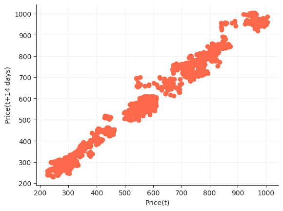

# Introduction
Reinforcement Learning is a paradigm that iterates over thousands of combinations of actions and achieves a strategy that maximizes the cumulative reward. Deep Reinforcement Learning uses deep neural networks for implementing reinforcement learning. In this project we develop a Deep Reinforcement Learning Algorithm to increase the profits from a given stock. We also implement a supervised learning algorithm using regression to predict the future stock prices and maximize the profits using the predictions. We then contrast the results from both the methods based on different metrics.

# Problem Statement

---

# Methods Explored
## SVM
Support-Vector Machines are supervised learning models that analyse data for classification and regression analyses. Each data point is viewed as a *p*-dimensional vector and the model aims to classify these data points using a *(p-1)*-dimensional hyperplane. The best hyperplane is that which has the largest margin between the two classes. In case the data points are not linearly separable, we map them to a higher dimensional space where they can be easily separated. We use Kernel functions for this depending on the type of data we have.

- Linear Kernel is the best option when the dataset is linearly separable.

- Radial Basis Function Kernel is used to map data points to an infinite-dimensional hyperspace to separate them. However, this often leads to overfitting and so we use generalisation to stop that.

- Polynomial Kernel is used to map data points to a higher dimension by using a polynomial function of degree *d*. Using a higher degree tends to overfit the data.

## Deep Q-Learning
### Q-Learning 
**Reinforcement Learning** is a process in which an *agent* is confined to an *environment* and tasked with learning how to *behave optimally* under different circumstances by interacting with the environment. The different circumstances the agent is subjected to, are called *states*. The goal of the agent is to know what *action*, amongst a set of allowed actions, must it take such as to yield maximum *reward*, defined for the action. 

**Q-Learning** is a type of Reinforcement Learning which uses *Q-Values* i.e., action values, to improve the behaviour of the agent in an iterative process. These Q-Values are defined for states and actions. Thus, `Q(S, A)` is an estimate of the quality of the action `A` at state `Q`. `Q(S, A)` can be represented in terms of the Q-value of the next state `S'` as follows - 


This is the *Bellman Equation*. It shows that the maximum future reward equals the reward received by the agent for entering the current state `S` added to the maximum future reward for the next state `S'`. With Q-Learning, the Q-values can be approximated iteratively with the help of the Bellman equation. This is also called Temporal Difference or *TD-Update rule* - 


Here, 
- S<sub>t</sub> is the current state and A<sub>t</sub> is the action picked according to a *policy*.
- S<sub>t+1</sub> is the next state and A<sub>t+1</sub> is the next action considered to effectively have maximum Q-value in the next state.
- `r` is the current reward obtained as a result of the current action.
- `Gamma` has values in the interval (0, 1] and is called the *discount factor* for future rewards. Future rewards are considered to be less valuable than current ones and are therefore discounted.
- `Alpha` is the learning rate or the step length for updating the Q-values. 

A simple policy commonly used is the *E-greedy policy*. Here, `E` is also called the *exploration*. This signifies -

- The agent chooses the action with the highest Q-value with a probability `1-E`.
- The agent chooses the action at random with a probability `E`.
Thus, a high exploration implies that the agent will explore more possibilities of actions at random. 

### The "Deep" in Deep Q-Learning 
The process of Q-Learning aims to create a Q-state vs action matrix for the agent which it uses to maximize its reward. However, this is highly impractical for real-world problems where there can be a huge number of states and actions associated. To solve this problem, it is inferred that the values in the Q-matrix have importance with respect to each other. Therefore, instead of actual values, approximated values can be used so long as the relative importance is preserved. Therefore, to approximate these values, a neural network is used. With the incorporation of neural network, it is thus called Deep Q-Learning. 

The working step for Deep Q-Learning is to feed the neural network with an initial state, which returns the Q-value of all possible actions as a result. *Experience Replay* is essentially a way of logically separating the learning phase from gaining experience. The system stores the agent's experience e<sub>t</sub> = (s<sub>t</sub>, a<sub>t</sub>, r<sub>t</sub>, s<sub>t+1</sub>) and learns from it. This is an advantage because the model makes use of previous experience by learning from it multiple times. When gaining real-world experience is expensive, experience replay is used to get maximum learning from previous experiences.

Therefore, Deep Q-Learning is a process in which an agent iteratively learns to maximize its reward in a given environment by exploring many possible actions at each achieved state using an E-greedy policy and a neural network to approximate Q-values.

---

# Data
Any kind of Financial data or stock data is a timeseries values within a certain frequency interval. In this project two different frequency data have been used. 
1. Google stock data with one day frequency, downloaded from Yahoo Finance in csv form and preprocessed to convert into to the required form for this project. 
2. JustDial stock data with one minute frequency has been scraped from Kite (An online trading platform) in json format. This is converted to csv and preprocessed to get required form. 

Both the stock's data consists of Open, High, Low, Close and Volume Traded for a particular time period. The price data in this form is not very helpful for the intended purpose. Indicators are functions which take one or more of these price values to make a new insight into the behavior of the stock. The following three indicators are added during preprocessing to augment the data -

Close/SMA
: Close value and Simple Moving Average alone cannot give much information to act upon, but when combined, the ratio Close/SMA gives us the trend of the price moment reacting to even small changes.

Bollinger Band Value
: Bollinger Bands are two line drawn at two standard deviations apart. Upper band, Middle band, and Lower band. The Middle band is a moving average line. The BB value is the calculated using these three values as (UpperBand-LowerBand)/MiddleBand

RSI
: Relative Strength Index is a momentum index that indicates the magnitude of recent changes in the price that evaluate to over bought and over sold conditions.

These indicators are calculated using TA-lib library.

## Google stock data
### Price Plot


### Volume Plot


### Indicators Plot


### Lag Plot


## Just Dial stock data
### Price Plot


### Volume Plot


### Indicators Plot


### Lag Plot


---

# Libraries
## scikit-learn

## Tensorforce
Tensorforce is an open source Deep Reinforcement Library that abstracts Reinforcement Learning Primitives with Tensorflow backend. It provides modularity and gives us the freedom to concentrate on the application rather than the specific implementation of the algorithm which is similar for every application. There are four high-level abstractions: Environment, Agent, Runner and Model. The Model abstraction sits inside the Agent and gives us the ability to change the internal mechanisms of the Agent itself. The Environment abstract is to help create custom user environment details. Runner is to execute the model.

```python
import tensorforce.agents import agents
import tensorforce.environments import Environment

#create and initialize environment
environment = Environment.create(environment=Environment)

#Create agent
agent = Agent.create(agent=agent)

agent.initialize()

states = environment.reset()
agent.reset()

while not terminal:
    actions = agent(states=states)
    next_state, terminal, reward = environment.execute(actions)
    agent.observe(reward=reward, terminal=terminal)

agent.close()
environment.close()
```

The Environment class is created by inheriting the Environment abstract.
The agent is created by providing required parameters as an input for the Agent class.
The agent initialization creates the tensorflow network and initializes all the network connections and memory required to store the state variables and action rewards.
The agents returns actions based on the state variable passed to it. These actions are passed to environment.
The environment executes these actions and gives back the reward associated with that action and if it is the terminal state.
The agent observes the reward and stores it in its memory to retrieve it another time.

---

---

# Methodology
## SVM
For each of our datasets we define an additional set of indicators along with those defined for Reinforcement Learning:
O-C - Defines the difference between opening and closing prices.
STD_10 - This is the Standard Deviation with a rolling window 10.

The decision labels are decided according to the trend in the market close prices.
- If the next close price is higher than the current close price, the model decides to buy. This is because the price is expected to further rise increasing the value of stocks possessed.
- If the next close price is lesser than the current close price, the model decides to sell. This is done so that in the expected eventuality where the price continues to fall, we can minimise the loss incurred.


## DQN

---

# Results

---

# Conclusion
